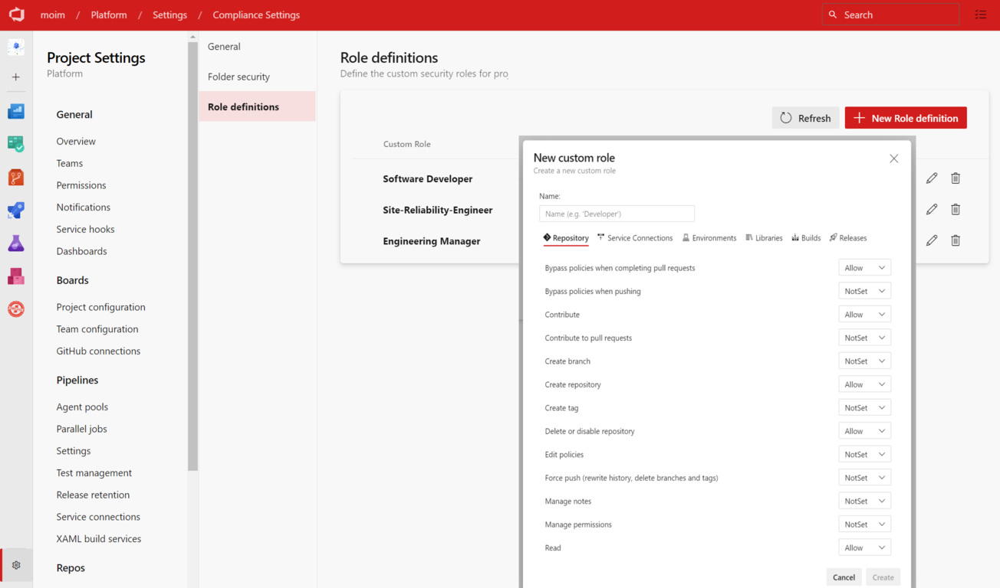
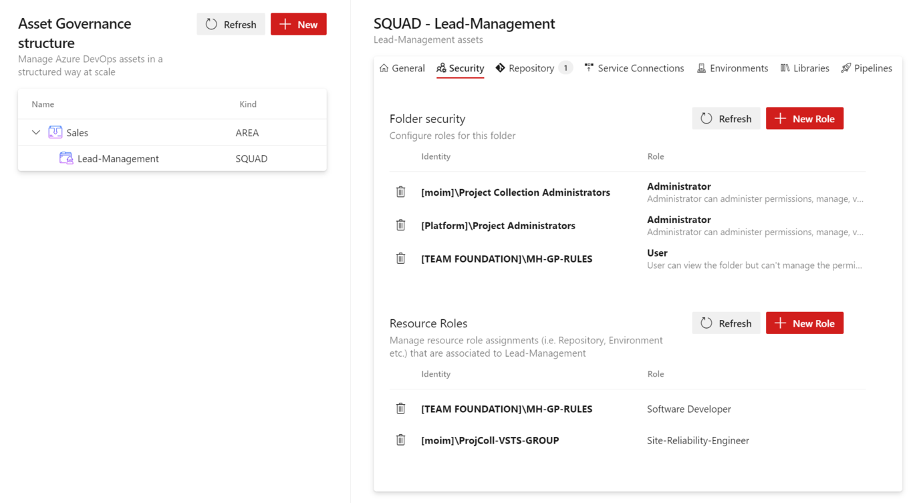

# Orion Guardian

Oriaon Guardian is an extension that allows managing and governing security and permissions of Azure DevOps resources in a structured way. This is specially more applicable when an Azure DevOps project has multiple teams working within and have different permission requirements. 

## About Orion Guardian Extension

The extension has two components:

- The user interface part of it. Which you install in your Azure DevOps organization.
- The backend API 

> The backend API is provided as Docker image and it is upto the consumer/customer to install that in their own infrastructure. The reason for that is, the Backend API require high-privileges to change/apply security within an Azure DevOps organization. It would only make more sense to own that component by the consumer instead of a 3rd party vendor. 

## How to install backend

The details instructures to install the backend can be found [here](https://moimhossain.com/2024/01/04/orion-guardian/). 

## Concept

### Custom Role definition
The administrators (or any other groups that are designated) can then also define **Role** - for instance, __Software Developers__, __Site Reliability Engineers__, __Scrum masters__, __Engineering managers__ etc. 

These roles can capture the permission set for each of the resources (like Repository, Library etc.)

### Structure
Azure DevOps doesn't provide a folder structure for more of the resources, like Repository, service endpoints, environments, libraries etc. This extension brings the notion of folder structure, where predefined groups (like Project Administrators) can create folder structure, then associate resources (like Repository, Service endpoint, Environment etc.) to those folders. 

### Role assignments (RBAC)
Finally, they can assign the custom defined roles to a folder - which makes the role management much more easier to follow and saves efforts managing them granularly for each resources. 

For further information: [moimhossain.com/orion-guardian](https://moimhossain.com/2024/01/04/orion-guardian/)

## Issues

You can create issue into the [GitHub repository](https://github.com/MoimHossain/orion-guardian/issues). 